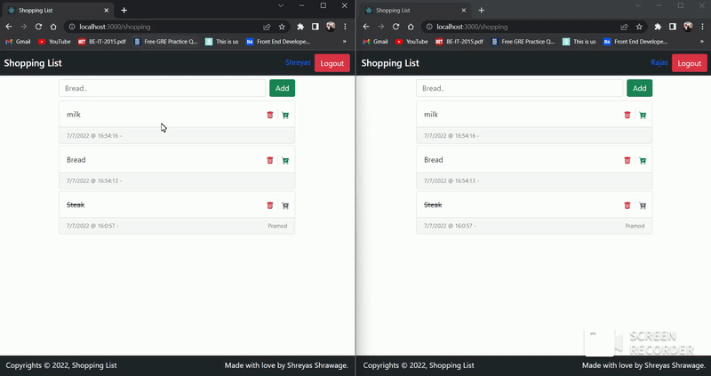
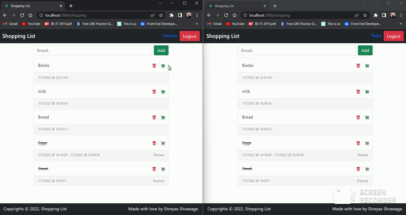
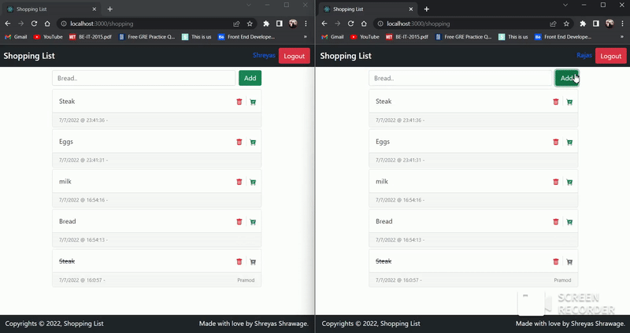

# Shopping-List 🛒📃

Shopping-List is not an ordinary todo-list. It utilizes crud functionalities to provide creation, deletion, etc. These functionalities, however, are dynamic, nimble and happen in real-time for the users sharing the list, all thanks to socket-io.

The main object of this project is to make users have access to a shared shopping-list. A user makes changes to it, while the others see it happening.

Below images portray some examples of using shopping-list.

## Adding an item to the list

## Deleting an item from the list

## Marking an item as completed

> <em><strong>Note</strong>: Images displayed above are gifs created using older version of shopping-list and only exist inorder to potray the app functionality.</em>

## Installation 🖥️

This project consists of a server and a client folder.
The server is built using **node.js** and **socket.io**, and is responsible for providing services to connect, sync and coordinate lists among users.
The client is the front-end framework built using **react.js** and **socket.io-client**.

- In order to get the project up and running, we need to install dependancies for both server and the client.
  - `$ cd server`
  - `$ npm install`
  - `$ cd ..`
  - `$ cd client`
  - `$ npm install`
- Set up a new [google cloud](https://console.cloud.google.com/) project
- Create a new firestore database
- Download the secret credential file from the console and save it as `firestore.json` in the `server` folder.

> <em><strong>Note</strong>: Make sure you add `firestore.json` file in `.gitignore` before committing the project to git.</em>

## Contributors ✨

<table>
  <tr>
    <td align="center"><a href="https://github.com/shreyventure">
      
       <b>Shreyas Shrawage</b></a> 
    </td>
  <tr>
<table>
